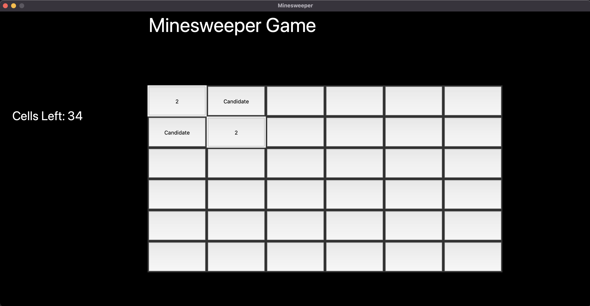
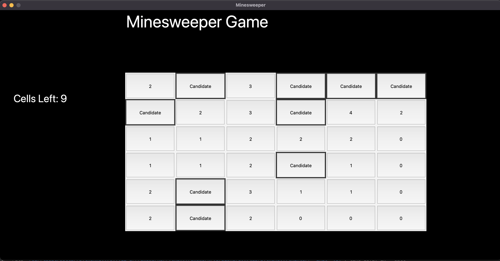

```txt 
   __    __      _____      __      _    _____    _____   ___       ___    _____    _____   _____     _____   ______    
   \ \  / /     (_   _)    /  \    / )  / ___/   / ____\ (  (       )  )  / ___/   / ___/  (  __ \   / ___/  (   __ \   
   () \/ ()       | |     / /\ \  / /  ( (__    ( (___    \  \  _  /  /  ( (__    ( (__     ) )_) ) ( (__     ) (__) )  
   / _  _ \       | |     ) ) ) ) ) )   ) __)    \___ \    \  \/ \/  /    ) __)    ) __)   (  ___/   ) __)   (    __/   
  / / \/ \ \      | |    ( ( ( ( ( (   ( (           ) )    )   _   (    ( (      ( (       ) )     ( (       ) \ \  _  
 /_/      \_\    _| |__  / /  \ \/ /    \ \___   ___/ /     \  ( )  /     \ \___   \ \___  ( (       \ \___  ( ( \ \_)) 
(/          \)  /_____( (_/    \__/      \____\ /____/       \_/ \_/       \____\   \____\ /__\       \____\  )_) \__/
```

## Table of Contents
* [Overview](#overview)
* [Dependencies](#dependencies)
* [Getting Started](#getting-started)
* [Roadmap](#roadmap)
* [References](#references)

## Overview
Minesweeper is a single player puzzle game. The goal of the game is to clear a grid that contains hidden mines without detonating any of them. Each time a selection is made it will either reveal that it is not a mine and give clues or detonate because its a mine.

This project was used as a way for me to further understand Object Oriented Programming in Python and become familiar with the Tkinter, Python interface library.  Currently this application only have full capabilities under Windows and Linux machine. Unfortunately, I have yet to find a solution for supporting dialog/message boxes in the MacOS environment. References freeCodeCamp course ["Python Game Development Using OOP."](https://www.youtube.com/watch?v=OqbGRZx4xUc) 



## Dependencies
* [Python v3.8](https://www.python.org/downloads/)
* [Tkinter](https://docs.python.org/3/library/tkinter.html)

## Getting Started
1. Run `python main.py` within the terminal to launch the game.

## Raodmap
* Fix grid count bug.
* Add test for Cell class.
* Make application MacOS compatible
